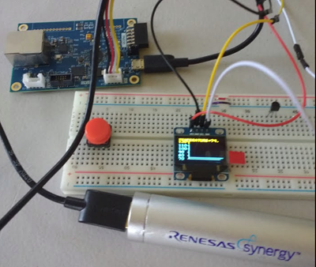
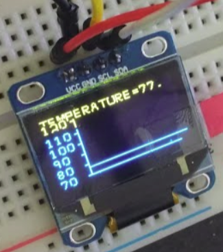
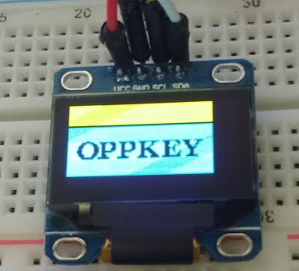
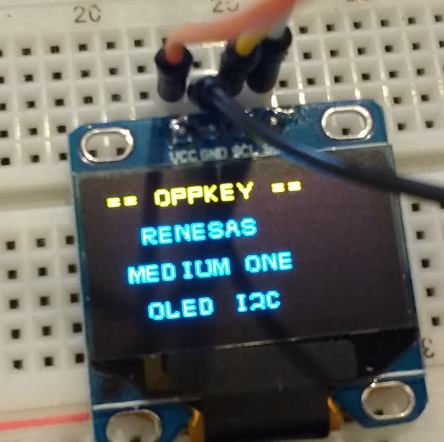
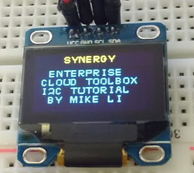
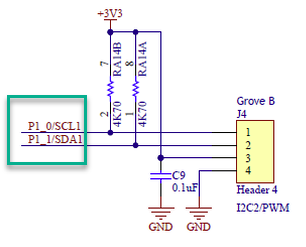

# Renesas AE-CLOUD1 i2c OLED Display
This is based on [Michael Li's project Renesas_s5d9_i2c_oled_display_ver2](https://github.com/mikelisfbay/Renesas_s5d9_i2c_oled_display_ver2).

The original project README.md is shown below.

## Original README from Michael Li for Renesas_s5d9_i2c_oled_display_ver2
The project uses C code to read the on board temperature sensor and show the reading on an OLED display module.  Version 2 has a number of improvements (all 26 letters (A-Z) are supported and message display method is simpler).

Develop the C code from scratch for the S5D9 board
Read the current temperature (F) from onboard AMS EN210 sensor (I2C interface).
Display the current temperature (F) on OLED display (I2C interface).
Display the temperature graphically over time on OLED display.

File Description:
1.  hal_entry.c/h  (Main Program Loop)
2.  i2c.c/h (i2c SSP API calls)
3.  en210.c/h (subroutines for AMS EN210 operations)
4.  ssd1306_oled.c/h (subroutines for OLED module operations)

5. S5D9_I2C_INT_ENV210_OLED.7z (7zip archive file for e2 studio project file for this project)  Unzip and import into your e2 studio.  It is ready to run if you cannot make your project to work

Datasheet:
ENS210_DS000470_1-00.pdf (Temperature sensor datasheet)
OLED Sepecification.pdf (OLED display module spec sheet)
SSD1306.pdf (OLED display driver chip datasheet)

https://www.miketechuniverse.com/single-post/2017/10/27/Tutorial-for-Renesas-S5D9-board-Show-The-Temperature-Reading-on-an-OLED-Display

---

## Project Pictures

### LCD Module Packaging

### Grove Connector Schematic

